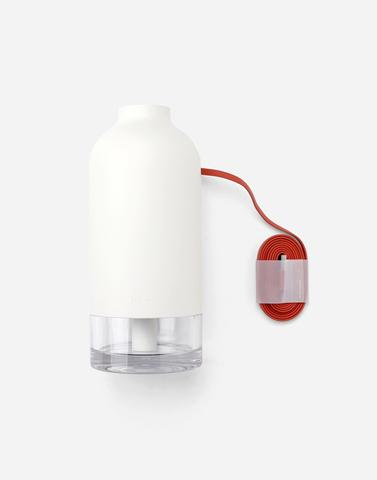

# Sample Code
The **data-img** attribute is used to attach the second image of your choice you would want swapped. Once this is done, simply add your **swim** class to the image element and you're good to go (**make sure jQuery script is included, it requires it to work properly**). Here's a sample below...
```
<!DOCTYPE html>
<html>
    <head>
        <meta charset="UTF-8"/>
        <title>Swap Images On Hover</title>
        <script src="https://ajax.googleapis.com/ajax/libs/jquery/3.3.1/jquery.min.js"></script>
        <link href="https://maxcdn.bootstrapcdn.com/bootstrap/3.3.7/css/bootstrap.min.css" rel="stylesheet"/>
        <link href="swapimagesonhover.css" rel="stylesheet" type="text/css"/>
        <script src="swapimagesonhover.js" type="text/javascript"></script>
    </head>

    <body>
        <section style="padding: 3em 0;">
            <div class="container">
                <div class="row">
                    <div class="col-sm-3">
                        <a href="product1.html">
                            
                        </a>
                    </div>
                    <div class="col-sm-3">
                        <a href="product2.html">
                            
                        </a>
                    </div>
                    <div class="col-sm-3">
                        <a href="product3.html">
                            
                        </a>
                    </div>
                    <div class="col-sm-3">
                        <a href="product3.html">
                            
                        </a>
                    </div>
                </div>
            </div>
        </section>
    </body>
</html>
```